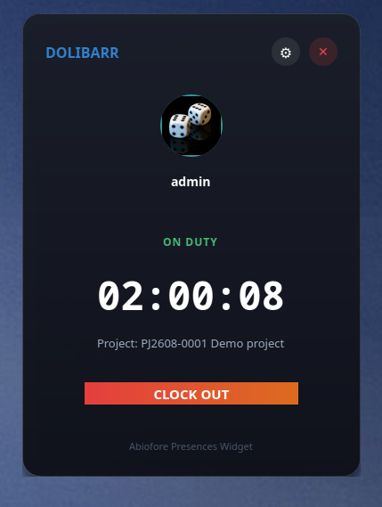
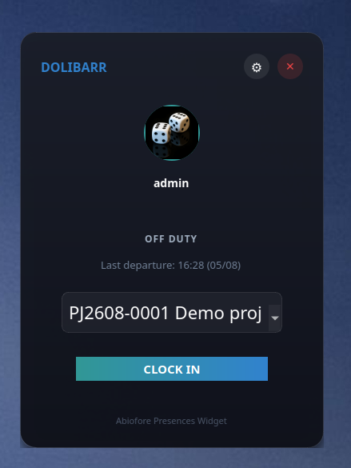

# Dolibarr Presences Clock-In Desktop Widget

**This is for archive purposes only as it interfaces with a custom API added to the employee-presence plugin for dolibarr by nextgestion.**

A gorgeous, premium, dark-themed PyQt5 desktop application designed for your Kubuntu/KDE desktop. It interfaces directly with custom REST API endpoints of the Dolibarr `presences` module.

<p align="center">
  
  
</p>

This widget is made to work with Dolibarr and this module : https://nextgestion.com/en/modules-dolibarr/50-employee-presence.html
---

## Features
* **Modern Glassmorphism UI**: Beautiful gradients, translucent dark-theme frames, smooth shadows, and animations.
* **Frameless Layout**: Draggable window that integrates seamlessly on Kubuntu desktops.
* **Smart Session Chronometer**: Shows live duration elapsed (hours, minutes, seconds) when clocked in.
* **Integrated Project & Task Selector**: Asks you to select which project you're working on when clocking in, automatically retrieving projects assigned to you.
* **Secure Local Config Storage**: Remembers your base URL, username, and `DOLAPIKEY` token across restarts in a secure local config.

---

## Prerequisites

To run this desktop widget on your Kubuntu machine (which already has Qt 5.15.3), make sure you have `python3-pip`, `PyQt5`, and `requests` installed:

```bash
sudo apt update
sudo apt install python3-pip python3-pyqt5
pip3 install requests
```

---

## Launching the Widget

To run the widget directly, execute:
```bash
python3 presences_widget.py
```

### Quick Launch Script (KRunner or KDE Application Menu)
You can make a desktop shortcut or trigger it directly. A helper shell launcher has been provided. Double-click it or trigger it via your KDE Application Launcher!

---

## Configuration & Usage

1. **First-time Login**: Upon launching, the widget will open the Login Setup Dialog:
   * **Dolibarr URL**: E.g., `http://dolibarr.mydomain.com`
   * **Username**: E.g. `admin`
   * **Password**: E.g. `adminpassword`
2. Click **Connect Widget**. It will automatically perform a secure token handshake, grab your `DOLAPIKEY`, and securely store it.
3. **Select Project**: If clocked out, select a project from the drop-down (fetched live from your assigned project tasks) and hit **CLOCK IN**.
4. **Ticking Chronograph**: When clocked in, the screen changes to an active pulsing state with a ticking chronograph counting time since you clocked in.
5. **Clock Out**: Hit **CLOCK OUT** at any time to check out; your timesheet will automatically be logged to your project tasks in the backend!
